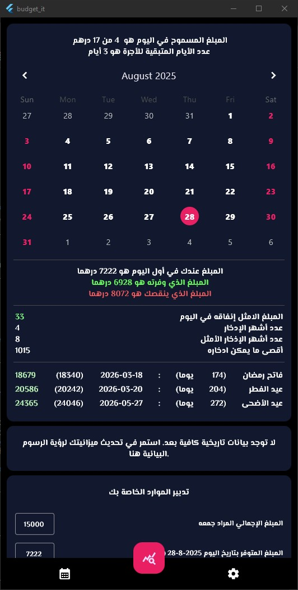
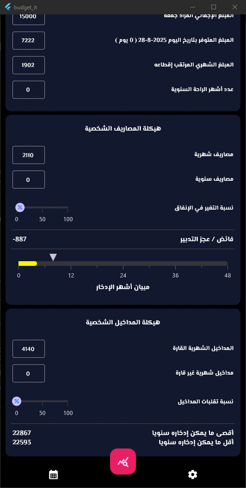
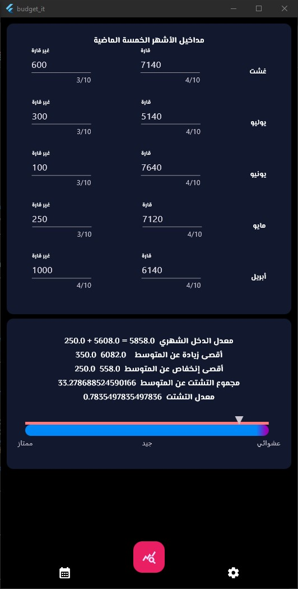
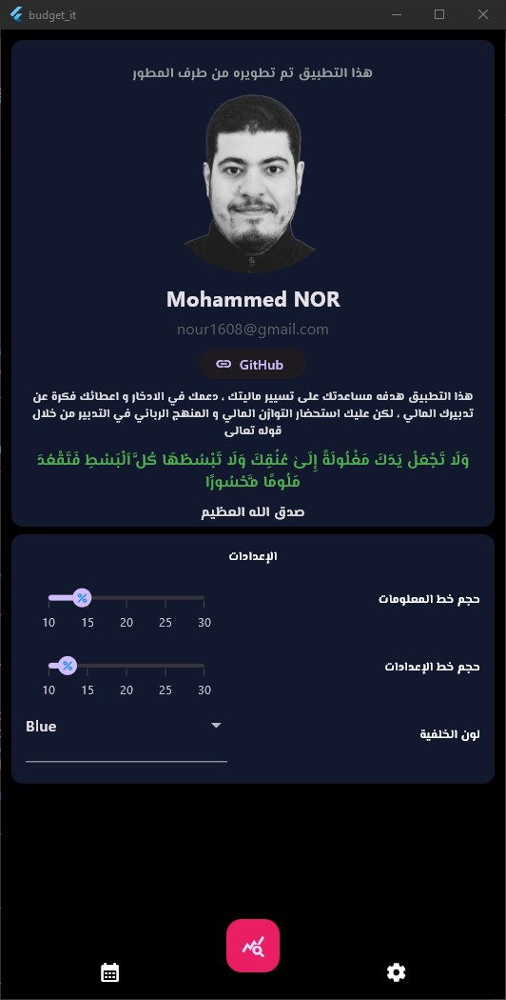

An App that "budget it" up for you , ideal for salaries ! Here you will find samples, guidance on mobile development, and a full API reference.

# Budget It!

Budget_It is a personal budgeting and financial tracking app built with Flutter. It helps you manage your monthly and annual finances, track your savings goals, and visualize your financial performance over time.

## Features

- **Monthly and Annual Budgeting:**
	- Set and adjust your monthly and annual income and expenses.
	- Track both stable and unstable (variable) income sources.
- **Savings Tracking:**
	- Set monthly savings goals and monitor your progress.
	- Visualize your net credit and savings growth over time.
- **Budget History:**
	- Automatically records changes to your budget, savings, and net credit.
	- View historical data and trends for the last 6 months.
- **Statistics and Analysis:**
	- See detailed stats and graphs for your budgeting performance.
	- Analyze best and worst months, average savings, and more.
- **Customizable UI:**
	- Light and dark themes.
	- Adjustable font sizes and card colors.
- **Data Storage:**
	- Uses Hive for fast, local, and persistent data storage.

## Getting Started

### Prerequisites
- [Flutter SDK](https://flutter.dev/docs/get-started/install)
- Dart

### Installation
1. Clone the repository:
	 ```sh
	 git clone https://github.com/mohammed-nor/Budget_It.git
	 cd Budget_It
	 ```
2. Install dependencies:
	 ```sh
	 flutter pub get
	 ```
3. Generate Hive adapters (if needed):
	 ```sh
	 dart run build_runner build --delete-conflicting-outputs
	 ```
4. Run the app:
	 ```sh
	 flutter run
	 ```

## Project Structure

- `lib/`
	- `main.dart` - App entry point
	- `models/` - Data models (e.g., `budget_history.dart`)
	- `screens/` - UI screens (e.g., `home.dart`, `budget.dart`, `stats.dart`)
	- `services/` - Utility and adapter files
- `test/` - Widget and unit tests

## Dependencies
- [Flutter](https://flutter.dev/)
- [Hive](https://pub.dev/packages/hive)
- [Hive Flutter](https://pub.dev/packages/hive_flutter)
- [GetX](https://pub.dev/packages/get)
- [Syncfusion Flutter Charts](https://pub.dev/packages/syncfusion_flutter_charts)
- [Intl](https://pub.dev/packages/intl)

## Screenshots

<p float="left">
  
  
  
  

</p>


## License

This project is licensed under the MIT License. See the [LICENSE](LICENSE) file for details.

---

**Developed by mohammed-nor**
