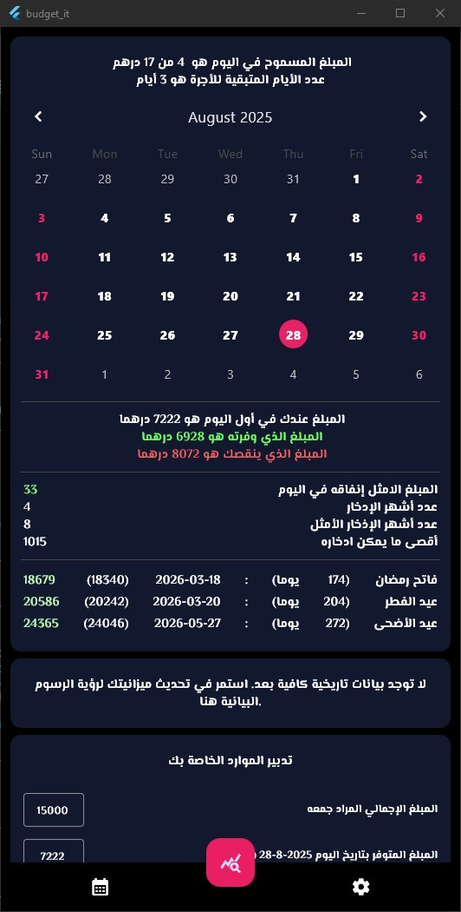
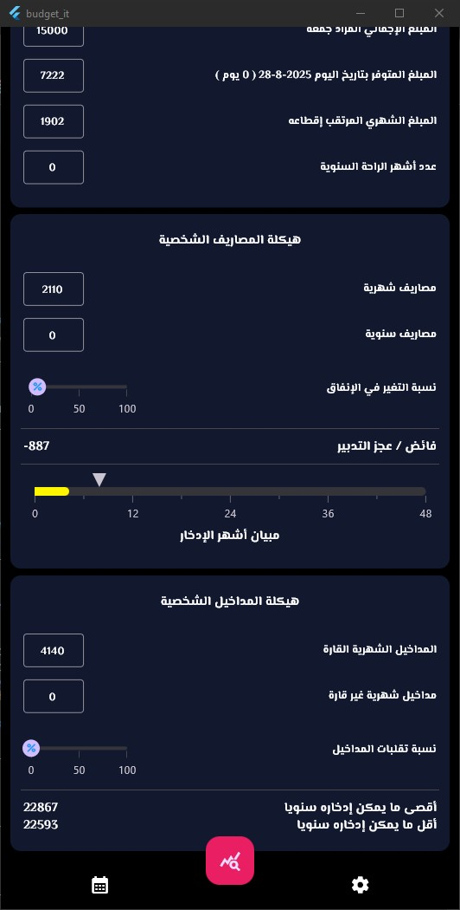
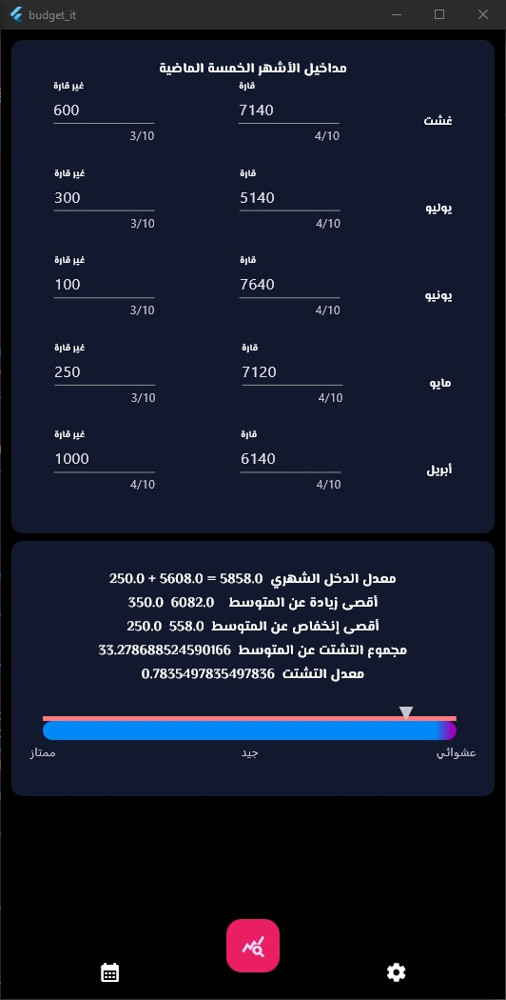
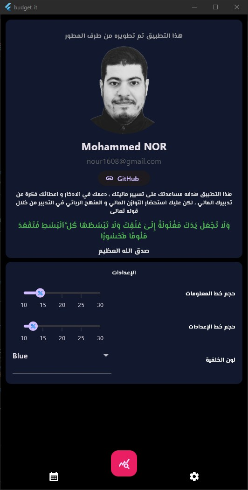

<div align="center">


# 💰 Budget It

**Your smart personal finance companion — built with Flutter.**

[](https://flutter.dev)
[](https://dart.dev)
[](https://github.com/mohammed-nor/Budget_It)
[](LICENSE)
[](https://github.com/mohammed-nor/Budget_It)

> _Effortlessly plan, track, and grow your finances — month by month, goal by goal._

</div>

---

## ✨ Features

<table>
<tr>
<td width="50%">

### 📅 Monthly & Annual Budgeting
Set and adjust your monthly and annual income and expenses. Track both **stable** and **variable** income sources with ease.

</td>
<td width="50%">

### 🎯 Savings Goal Tracking
Define monthly savings goals and monitor your progress in real-time. Watch your net credit and savings grow over time.

</td>
</tr>
<tr>
<td width="50%">

### 📊 Statistics & Analysis
View detailed graphs and stats for your budgeting performance. Discover your **best/worst months**, average savings, and spending trends.

</td>
<td width="50%">

### 🗂️ Budget History
Your budget automatically records past changes to income, savings, and net credit. Explore historical trends for the **last 6 months**.

</td>
</tr>
<tr>
<td width="50%">

### 🎨 Customizable UI
Switch between **light and dark themes**, adjust font sizes, and personalize card colors to match your style.

</td>
<td width="50%">

### ⚡ Fast Local Storage
Powered by **Hive** for lightning-fast, offline-first, persistent data — no internet required.

</td>
</tr>
</table>

---

## 📸 Screenshots

<div align="center">
<table>
  <tr>
    <td align="center"><br/><sub><b>Home Screen</b></sub></td>
    <td align="center"><br/><sub><b>Budget Overview</b></sub></td>
    <td align="center"><br/><sub><b>Statistics</b></sub></td>
    <td align="center"><br/><sub><b>Settings</b></sub></td>
  </tr>
</table>
</div>

---

## 🚀 Getting Started

### Prerequisites

Before you begin, ensure you have the following installed:

| Tool | Version | Link |
|------|---------|------|
| Flutter SDK | ≥ 3.x | [Install Flutter](https://flutter.dev/docs/get-started/install) |
| Dart SDK | ≥ 3.8.0 | [Install Dart](https://dart.dev/get-dart) |
| Git | Latest | [Install Git](https://git-scm.com/) |

### ⚙️ Installation

```bash
# 1️⃣  Clone the repository
git clone https://github.com/mohammed-nor/Budget_It.git
cd Budget_It

# 2️⃣  Install dependencies
flutter pub get

# 3️⃣  Generate Hive adapters (if needed)
dart run build_runner build --delete-conflicting-outputs

# 4️⃣  Run the app
flutter run
```

---

## 🗂️ Project Structure

```
Budget_It/
├── lib/
│   ├── main.dart              # 🚀 App entry point
│   ├── models/                # 📦 Data models (e.g., budget_history.dart)
│   ├── screens/               # 🖥️ UI screens (home, budget, stats, settings)
│   └── services/              # 🔧 Utilities & Hive adapters
├── test/                      # 🧪 Widget & unit tests
├── screenshots/               # 📸 App preview images
├── images/                    # 🖼️ App assets & icons
└── pubspec.yaml               # 📋 Dependencies & config
```

---

## 📦 Dependencies

| Package | Purpose |
|---------|---------|
| [`hive`](https://pub.dev/packages/hive) | Local data storage |
| [`hive_flutter`](https://pub.dev/packages/hive_flutter) | Hive Flutter integration |
| [`get`](https://pub.dev/packages/get) | State management & navigation |
| [`syncfusion_flutter_charts`](https://pub.dev/packages/syncfusion_flutter_charts) | Beautiful financial charts |
| [`syncfusion_flutter_gauges`](https://pub.dev/packages/syncfusion_flutter_gauges) | Gauge widgets |
| [`syncfusion_flutter_sliders`](https://pub.dev/packages/syncfusion_flutter_sliders) | Slider components |
| [`google_fonts`](https://pub.dev/packages/google_fonts) | Premium typography |
| [`table_calendar`](https://pub.dev/packages/table_calendar) | Calendar widget |
| [`hijri`](https://pub.dev/packages/hijri) | Hijri calendar support |
| [`intl`](https://pub.dev/packages/intl) | Internationalization |
| [`url_launcher`](https://pub.dev/packages/url_launcher) | Launch external URLs |
| [`shared_preferences`](https://pub.dev/packages/shared_preferences) | Persistent preferences |
| [`flutter_native_splash`](https://pub.dev/packages/flutter_native_splash) | Native splash screen |

---

## 📄 License

This project is licensed under the **MIT License** — see the [LICENSE](LICENSE) file for details.

---

<div align="center">

Made with ❤️ by [**mohammed-nor**](https://github.com/mohammed-nor)

⭐ _If you find this project helpful, please give it a star!_ ⭐

</div>
